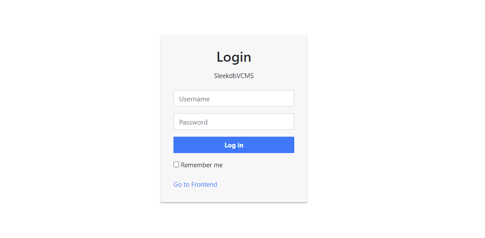
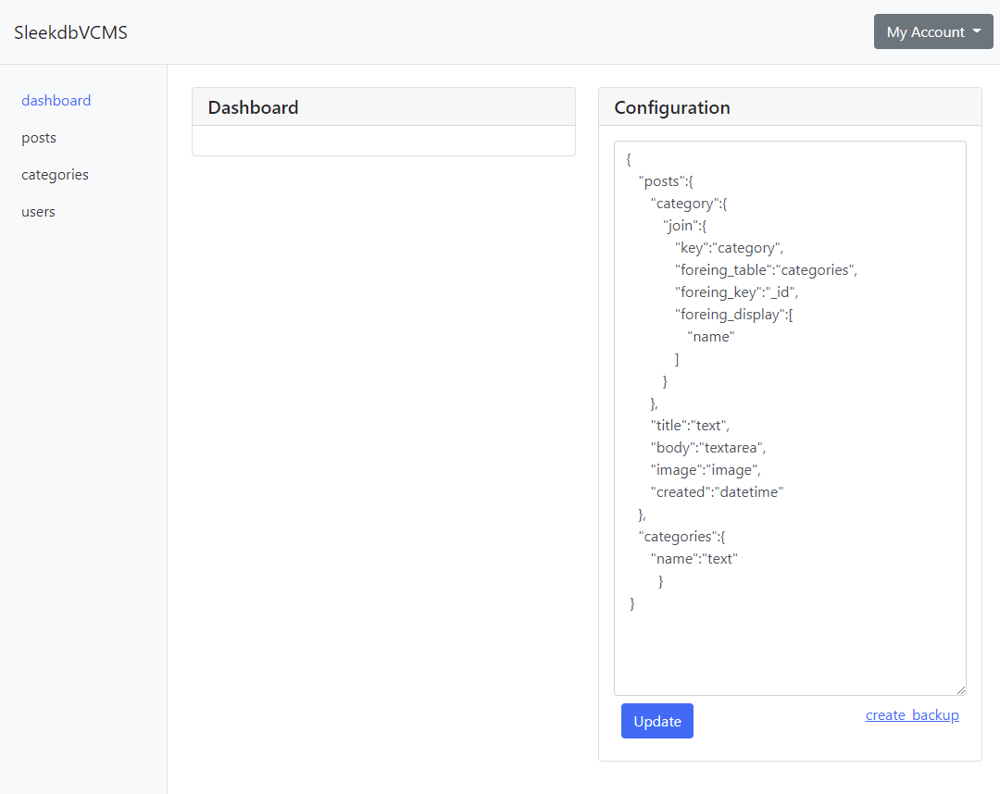
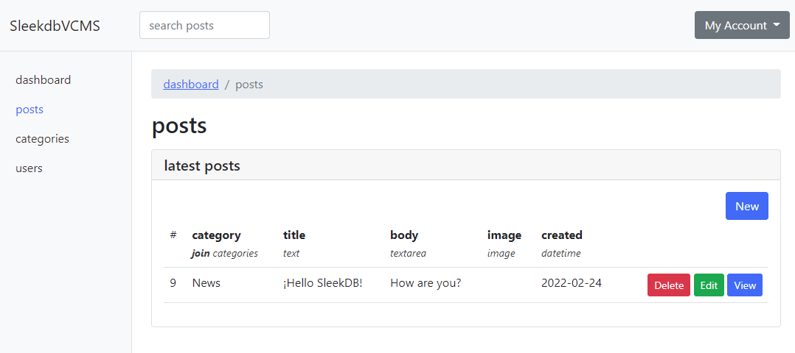
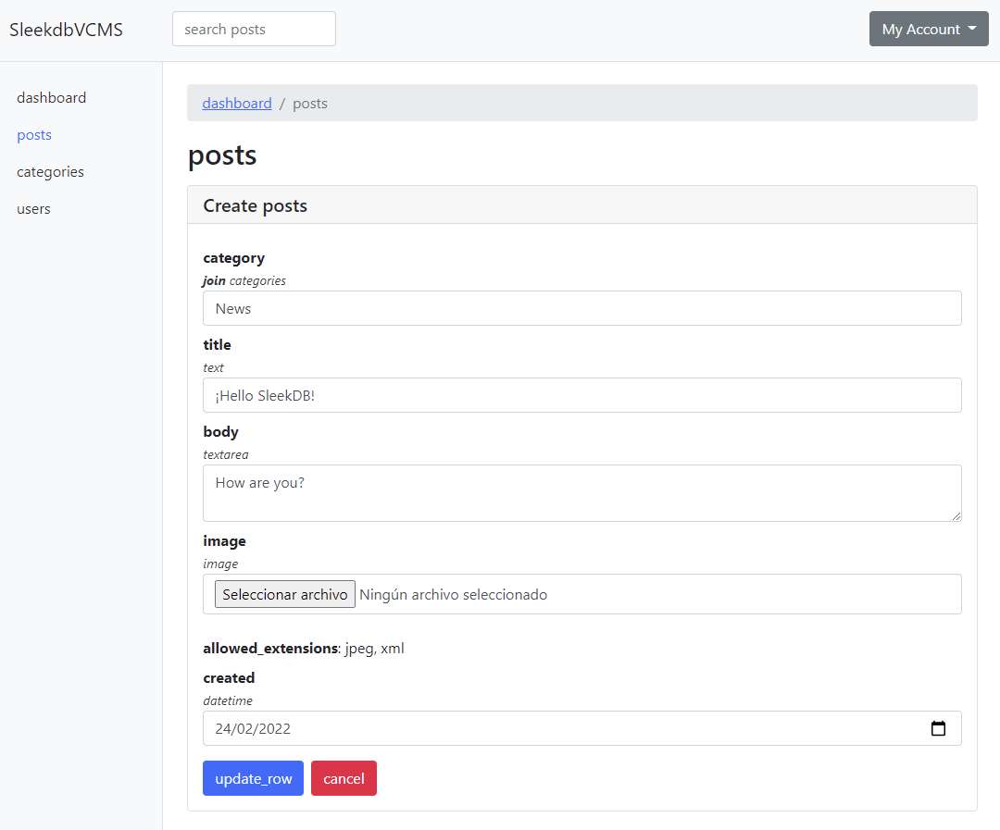

# SleekDBVCMS - Modern NoSQL Content Management System

SleekDBVCMS is a lightweight, modern CMS built on top of [SleekDB](https://sleekdb.github.io/) - a simple and efficient NoSQL database implemented in PHP. This CMS provides a clean, intuitive interface for managing content without the complexity of traditional database systems.

## Features

- **Modern Architecture**: Built following SOLID and KISS principles
- **Secure Authentication**: Built-in user management with secure password hashing
- **Dynamic Content Types**: Create custom content types with various field types
- **Media Management**: Built-in image upload and management
- **Responsive Design**: Modern Bootstrap-based UI that works on all devices
- **Extensible**: Easy to extend with new field types and features
- **Rich Text Editor**: Integrated TinyMCE for content editing
- **Fast & Light**: No heavy database requirements, runs on simple PHP

## Requirements

- PHP >= 8.1
- ext-json
- Composer

## Installation

1. Clone the repository:
```bash
git clone https://github.com/borjajimnz/SleekDBVCMS.git
cd SleekDBVCMS
```

2. Install dependencies:
```bash
composer install
```

3. Set permissions:
```bash
chmod -R 777 storage
chmod -R 777 public
```

4. Start the development server:
```bash
cd public
php -S localhost:8000
```

5. Access the CMS at `http://localhost:8000`

Default credentials:
- Username: admin
- Password: password

## Configuration

### Basic Configuration

Edit `config.php` to customize your installation:

```php
return [
    'app_name' => 'Your App Name',
    'public_path' => __DIR__ . '/public',
    'locale' => 'en',
    'upload_files_extensions_allowed' => [
        'image/jpeg' => 'jpeg',
        'image/png' => 'png',
        'text/xml' => 'xml',
    ],
    'options' => [
        'auto_cache' => false,
        'timeout' => 121
    ],
];
```

### Content Types

Define your content types in `.default_stores` using JSON:

```json
{
    "posts": {
        "title": "text",
        "content": "rich_textarea",
        "image": "image",
        "published": "datetime"
    },
    "products": {
        "name": "text",
        "price": "decimal",
        "description": "textarea",
        "featured": "checkbox"
    }
}
```

## Available Field Types

- **text**: Simple text input
- **textarea**: Multi-line text input
- **rich_textarea**: TinyMCE rich text editor
- **password**: Secure password field with hashing
- **image**: Image upload with preview
- **color**: Color picker
- **url**: URL input with validation
- **number**: Numeric input
- **decimal**: Decimal number input
- **email**: Email input with validation
- **datetime**: Date and time picker

## Architecture

SleekDBVCMS follows a modern, object-oriented architecture:

### Core Components

- **Core**: Central service container and application core
- **DatabaseInterface**: Database abstraction layer
- **AuthenticationService**: Handles user authentication
- **FileManager**: Manages file uploads and storage
- **FormBuilder**: Generates dynamic forms
- **ConfigurationService**: Manages application configuration

### Directory Structure

```
src/
├── Controllers/
│   └── AdminController.php
├── Forms/
│   ├── InputTypeInterface.php
│   └── Types/
├── Interfaces/
│   ├── DatabaseInterface.php
│   └── AuthenticationInterface.php
├── Services/
│   ├── AuthenticationService.php
│   ├── ConfigurationService.php
│   ├── FileManager.php
│   └── SleekDBManager.php
└── Views/
    ├── dashboard.php
    ├── form.php
    ├── layout.php
    ├── login.php
    └── table.php
```

## Screenshots

### Login Screen


### Dashboard


### Content Management


### Content Editing


## Contributing

1. Fork the repository
2. Create your feature branch: `git checkout -b feature/my-feature`
3. Commit your changes: `git commit -am 'Add new feature'`
4. Push to the branch: `git push origin feature/my-feature`
5. Submit a pull request

## License

This project is licensed under the MIT License - see the LICENSE file for details.

## Credits

- SleekDB created by [Timu57](https://github.com/Timu57) with support from [rakibtg](https://github.com/rakibtg)
- CMS implementation by [borjajimnz](https://github.com/borjajimnz)