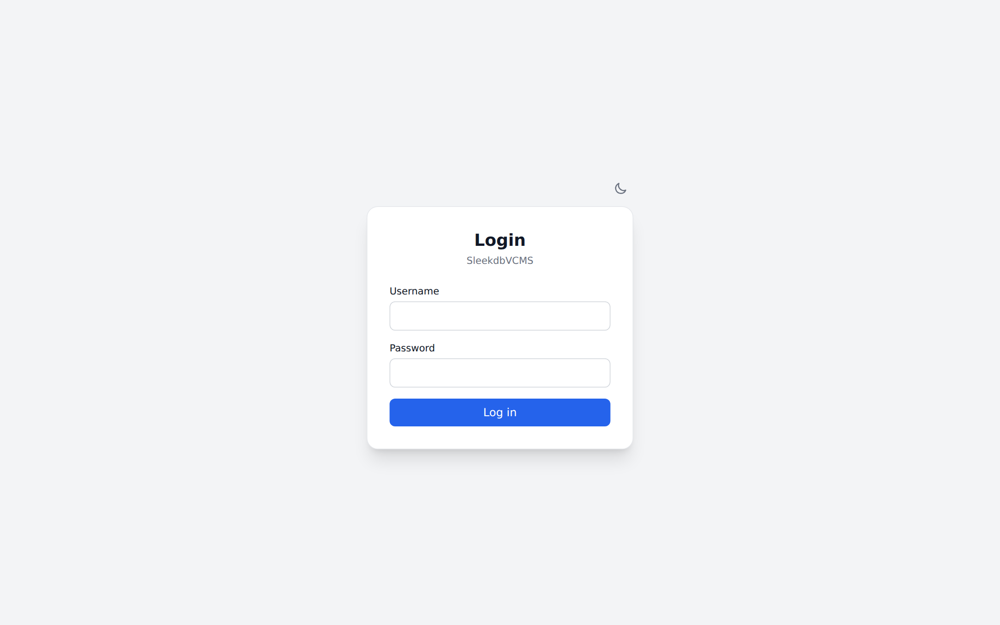
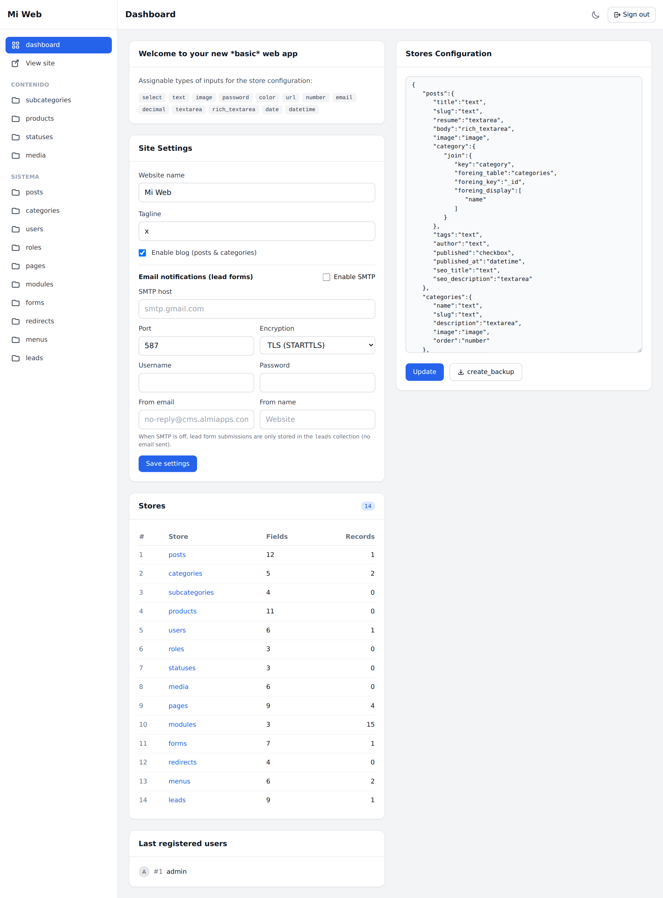
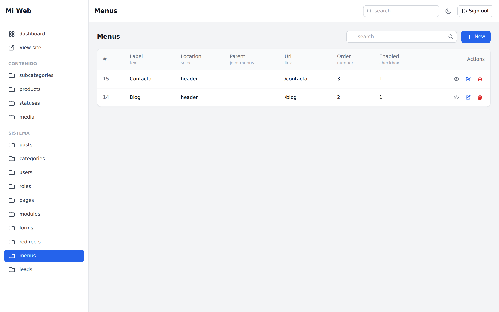
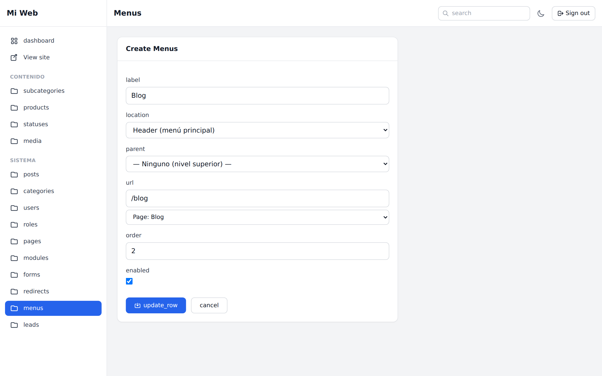
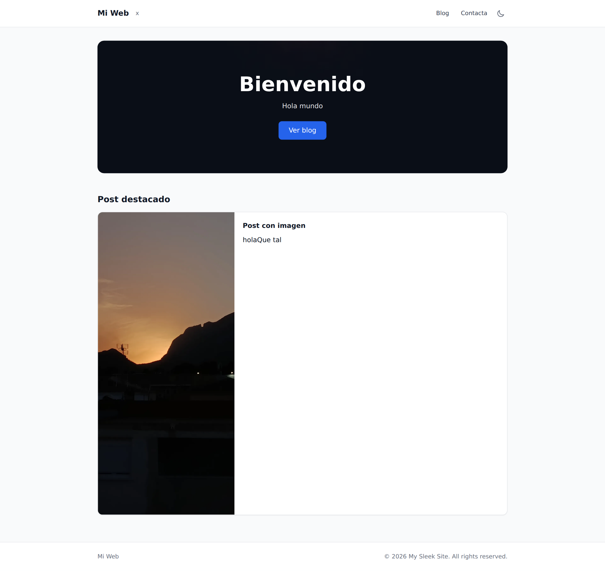

# SleekDBVCMS

**Version 3.0**

A lightweight, modern PHP CMS on top of [SleekDB](https://sleekdb.github.io/) — a flat-file NoSQL database. No MySQL/Postgres: every "table" is a folder under `storage/stores/` containing JSON files.

Two front-ends on the same domain:

- **Admin CMS** at `/cms/` — server-rendered Tailwind CSS views, mobile-first, dark mode.
- **Public front** at `/` — auto-discovers stores, configurable menu/header/footer, rendered with Blade.

## Features

- **Flat-file NoSQL**: no database server required — SleekDB stores JSON documents on disk.
- **Dynamic content types**: define stores in `.default_stores` with 20+ field types (text, rich text, image, color, url, number, decimal, email, date/datetime, checkbox, select, password, join relations, repeater, modules, link picker, form builder).
- **Pages & modules**: pages are built from reusable module templates (hero, text, store list, store item, lead form, CTA, split, features, stats, testimonials, FAQ, pricing, logos, video). Templates hold only configuration; each page instance stores its own values.
- **Menus**: header/footer navigation with sub-menus, internal-link picker and external URLs.
- **Forms & leads**: `lead_form` modules reference form templates; submissions are stored in the `leads` store and optionally emailed via SMTP.
- **SEO**: pretty URLs, XML sitemap, and a `redirects` store for 301/302/307/308 rules.
- **Media**: raster uploads are downscaled and converted to WebP (GD, EXIF orientation applied).
- **JSON API**: lightweight endpoints in `public/api/`.
- **Tailwind CSS + dark mode**: compiled at build time, no CDN on page.
- **Secure auth**: password hashing, session-based login, protected `users` store.

## Requirements

- PHP >= 8.1 (ext-json, ext-gd for image processing, ext-fileinfo)
- Composer
- Node.js + npm (only to rebuild the Tailwind stylesheet)

## Installation

```bash
git clone https://github.com/borjajimnz/SleekDBVCMS.git
cd SleekDBVCMS

composer install
npm install
npm run build:css      # compiles tailwind/input.css -> public/dist/tailwind.css

chmod -R 777 storage backups
```

Start the dev server:

```bash
cd public
php -S localhost:8000
```

Access the admin CMS at `http://localhost:8000/cms/` and the public front at `http://localhost:8000/`.

Default credentials:
- Username: admin
- Password: password

## Configuration

### Config.php

`Config.php` (required from `Bootstrap.php`) sets a global `$config` array — it does **not** return:

```php
$config = [
    'app_name' => 'SleekDBVCMS',
    'public_path' => __DIR__ . '/public',
    'locale' => 'es',
    'upload_files_extensions_allowed' => [...],
    'options' => [
        'image_max_side' => 1920,
        'image_quality' => 80,
    ],
];
```

### Runtime settings

`storage/settings.json` holds site settings editable from the dashboard: `site_name`, `tagline`, `blog_enabled`, plus SMTP notification settings for lead emails.

### Content types

Define content types in `.default_stores` (JSON). Field types: `text`, `textarea`, `rich_textarea`, `password`, `image`, `color`, `url`, `number`, `decimal`, `email`, `datetime`, `date`, `checkbox`, `select`, `link`, `modules`, `form_fields`, `repeater`, `module_schema`, and `join` blocks:

```json
{
    "posts": {
        "title": "text",
        "body": "rich_textarea",
        "category": { "join": { "key": "category", "foreing_table": "categories", "foreing_key": "_id", "foreing_display": ["name"] } }
    }
}
```

## URL scheme

**Admin CMS** (`/cms/`):

- `GET /cms/` — dashboard
- `GET /cms/?p=<store>` — table listing (POST `search=` filters)
- `GET /cms/?p=<store>&insert=1` — create form
- `GET /cms/?p=<store>&update=1&id=N` — edit form
- `GET /cms/?p=<store>&view=1&id=N` — read-only view
- `POST insert_row` / `update_row` / `delete` — mutations
- `POST update_config` — save content types
- `GET /cms/?backup=1` — zip backup of `storage/`
- `GET /cms/?logout=1`

**Public front** (`/`):

- `GET /` — home page (`is_home` in the `pages` store)
- `GET /<page-slug>` — a page (page wins over a store with the same name; `?preview=1` previews drafts with an admin session)
- `GET /<store>` — store listing (used by `store_list` modules)
- `GET /<store>/<id>` — item detail
- `GET /sitemap.xml` — XML sitemap

## Front-end templating

The public front uses [jenssegers/blade](https://github.com/jenssegers/blade) v2 (standalone Laravel Blade). Views live in `public/views/*.blade.php`, module partials in `public/views/modules/*.blade.php`. The admin CMS stays plain PHP templates in `src/Views/`.

Tailwind is compiled at build time to `public/dist/tailwind.css` (`npm run build:css`). No CDN is used on any page.

## Architecture

- `Bootstrap.php` — composition root; builds the `Core` container, seeds the admin user, wires error handlers.
- `src/Core.php` — DI container: `getDatabase()`, `getAuth()`, `getConfig()`, `getFileManager()`, `getFormBuilder()`, `getLogger()`, `getBlade()`.
- `src/Services/` — `SleekDBManager` (SleekDB wrapper), `AuthenticationService`, `ConfigurationService`, `BladeRenderer`, `EmailService`, `FileManager`, `Logger`.
- `src/Controllers/AdminController.php` — all admin routes/actions.
- `src/Forms/FormBuilder.php` + `src/Forms/Types/*` — input rendering per field type.
- `src/Views/` — admin templates (`layout.php`, `login.php`, `dashboard.php`, `table.php`, `form.php`).
- `src/Interfaces/` — `DatabaseInterface`, `AuthenticationInterface`.

### Directory structure

```
public/
├── index.php          # public front (path router + Blade rendering)
├── config.php         # public menu/labels/header/footer/theme
├── views/             # Blade templates (public front)
├── cms/index.php      # admin CMS entry
├── api/index.php      # JSON API
└── dist/tailwind.css  # compiled stylesheet
src/
├── Controllers/
├── Forms/Types/
├── Interfaces/
├── Services/
└── Views/
storage/
├── stores/            # SleekDB JSON collections
├── public/            # uploaded media (served at /storage/...)
├── logs/cms.log
└── blade-cache/
```

## Pages, modules, menus & forms

- **`pages`** — system + protected store. Fields include `title`, `slug`, `published`, `show_in_menu`, `menu_order`, `is_home`, `seo_title`, `seo_description`, and `modules` (per-page module instances).
- **`modules`** — module templates (configuration only, never values). Supported types: `hero`, `text`, `store_list`, `html`, `store_item`, `lead_form`, `cta`, `split`, `features`, `stats`, `testimonials`, `faq`, `pricing`, `logos`, `video`.
- **`menus`** — header/footer navigation items with `label`, `location`, `parent` (self-join for sub-menus), `url` (internal-link picker or external URL), `order`, `enabled`.
- **`forms`** — form templates referenced by `lead_form` modules: `title`, `subtitle`, `fields` (field builder), `notify_to`, `notify_cc`, `button_text`, `success_message`.
- **`leads`** — submissions of `lead_form` modules.
- **`redirects`** — SEO redirect rules (`source` → `target`, HTTP code, enabled).
- **System stores** re-merged on every boot: `users`, `pages`, `modules`, `posts`, `categories`, `redirects`, `leads`, `forms`, `menus`. Only `users` is protected from deletion.

## Screenshots

### Login Screen


### Dashboard


### Content Management


### Content Editing


### Public Front


## Contributing

1. Fork the repository
2. Create your feature branch: `git checkout -b feature/my-feature`
3. Commit your changes: `git commit -am 'Add new feature'`
4. Push to the branch: `git push origin feature/my-feature`
5. Submit a pull request

## License

This project is licensed under the MIT License — see the LICENSE file for details.

## Credits

- SleekDB created by [Timu57](https://github.com/Timu57) with support from [rakibtg](https://github.com/rakibtg)
- CMS implementation by [borjajimnz](https://github.com/borjajimnz)
